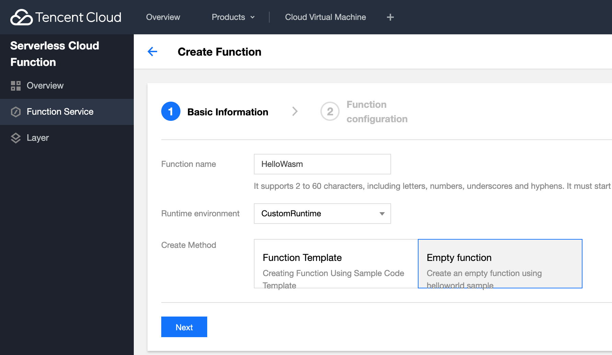
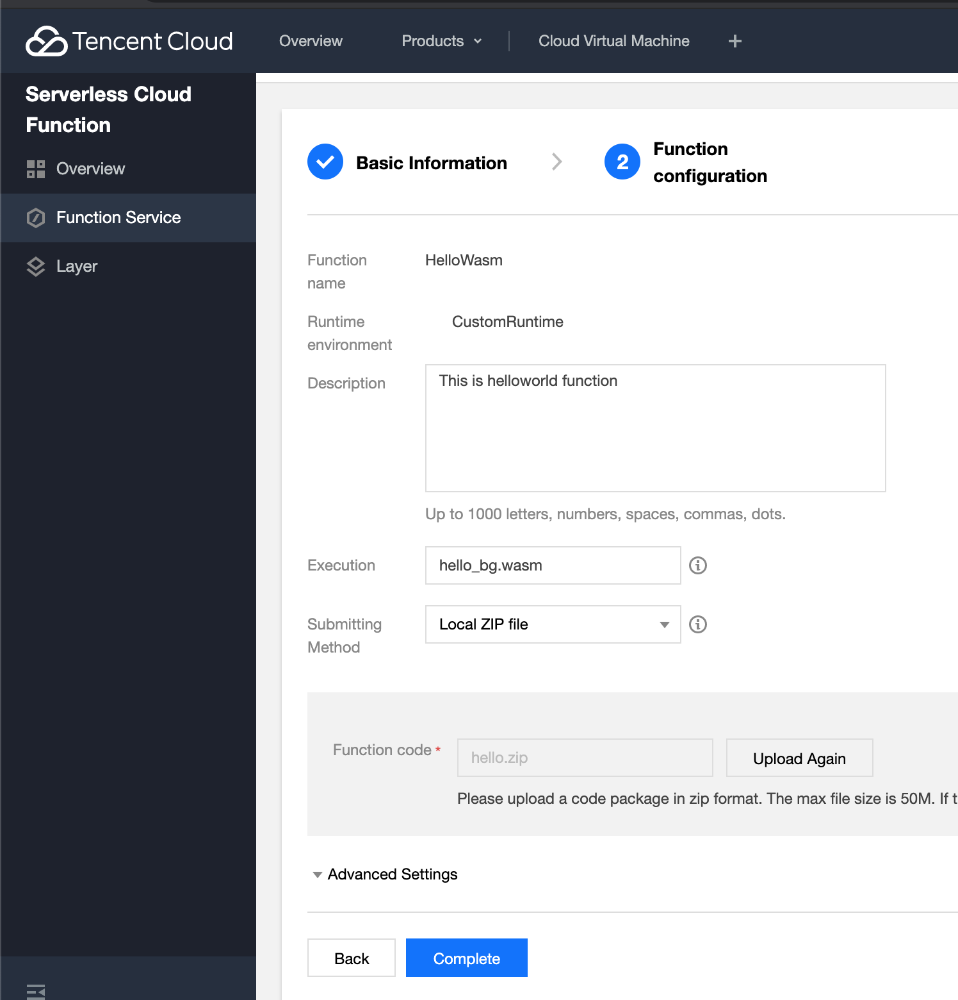
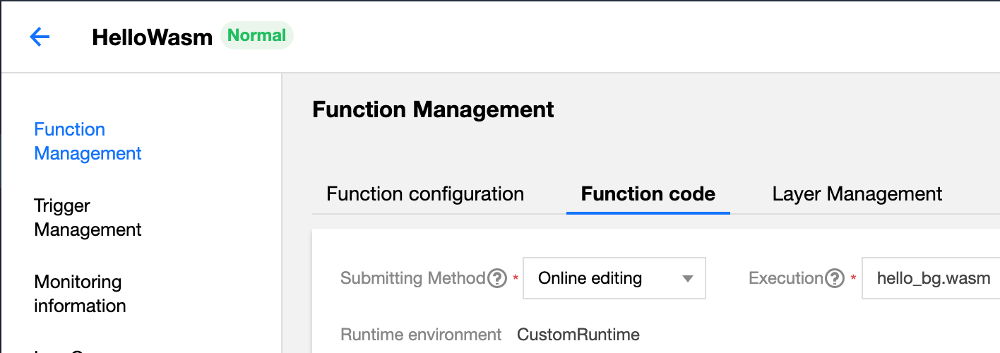
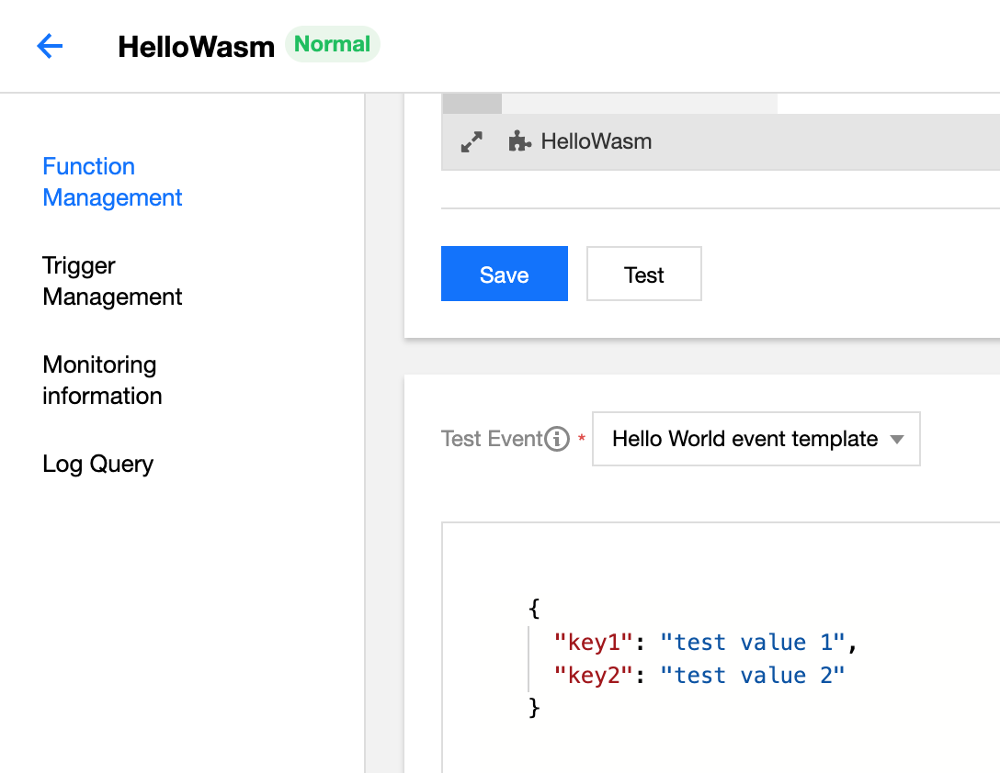
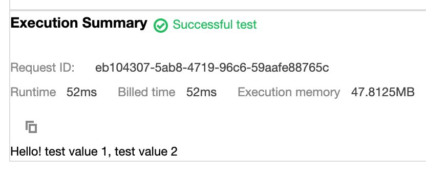

# Rust and WebAssembly Function as a Service (FaaS) on Tencent Cloud

## Prerequisites

If you have not done so already, follow these simple instructions to [install ssvmup](https://www.secondstate.io/articles/ssvmup/) on your development computer.

## Build the WASM bytecode

We build a [Rust function as a service](src/main.rs). It simply takes the function input from STDIN and outputs the results into STDOUT. That allows it to be used in a variety of different scenarions and payloads.

```
$ ssvmup build
```

## Package for deployment

```
$ cp pkg/hello_bg.wasm cloud/
$ cd cloud
$ zip hello.zip *
```

## Deploy on TencentCloud

0 Go to the console https://cloud.tencent.com/?lang=en

1 Go to Products | Serverless Cloud Function | Function Service | Create

2 For Create Method, select CustomRuntime from the dropdown list

3 Select the Empty function template

4 Click on Next



5 Set the Execution handler to `hello_bg.wasm`

6 Select "Local zip file" for Submitting Method, and then upload the `hello.zip` file

7 Click on Complete



## Test

Once the function is successfully deployed, go to the Function code tab.



Scroll down and click on the Test button. The function will take the hello world JSON data input

```
{
  "key1": "test value 1",
  "key2": "test value 2"
}
```



and output a hello message.

```
Hello! test value 1, test value 2
```



That's it! You have now tested and deployed your first server-side WebAssembly function!

## Next step

The next step is to create a complete demo to run and visualize a machine learning algorithm.

